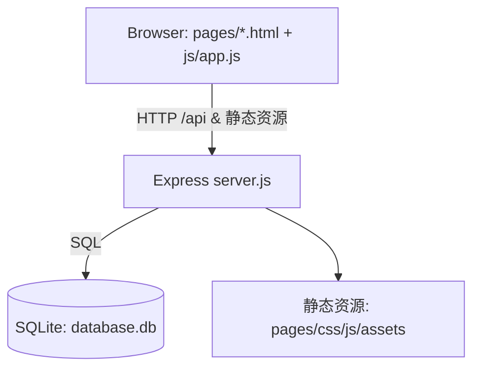

# EasyCRM 项目概览

本文件为 EasyCRM 的项目扫描与分析报告，旨在帮助新加入的开发者快速理解系统用途、技术栈、架构、数据模型、API 及本地运行方式。

- 仓库定位：单体应用，Node.js/Express + SQLite，前端为原生 HTML/CSS/JS，由 Express 直接提供静态资源。
- 主要目录：server.js 为后端入口；pages/、css/、js/ 为静态前端；init-db.js 为数据库初始化与示例数据脚本。

## 功能与模块

业务功能模块与关系（部分关键项）：
- 客户管理
  - 客户基本信息管理（姓名、联系人方式、公司/职位、地区、分类、意向、预算、备注等）
  - 层级联系人：上级联系人 SuperiorContacts、下级联系人 SubordinateContacts（Customers 表内以 JSON 串形式保存 subordinateContactIds）
  - 计划回访字段：planned_visit_date/method/content
  - 生日、微信/WhatsApp/Facebook 等多渠道字段
- 产品/订单管理（Products）
  - 记录客户购买的产品、数量、价格、购买日期、售后记录
  - 自动生成产品回访日期（购买日期 + 90 天）
- 回访记录（Visits）
  - 支持内容、效果、满意度、意向变化、后续跟进等
- 仪表盘与报表
  - 销售额、订单数、新增客户数、跟进次数、成交客户数、客户意向分布
  - 重要提醒聚合：计划回访、客户生日、计划客户回访（Customers. planned_visit_*）、产品回访
- 预设/管理类数据
  - 客户分类（CustomerCategories）与意向等级（CustomerIntentions）
  - 地区（Regions）、预算范围（BudgetRanges）
  - 回访方式（VisitMethods）、回访类型（VisitTypes）
  - 导航模式（NavigationModes）
  - 提醒周期（ReminderCycles）
  - 预设产品（PresetProducts）
- 用户与设置
  - 管理员登录（Managers 表，简易令牌返回）
  - 用户设置（深色模式、提醒开关、语言、最近备份时间）
- 数据备份/恢复与清空
  - 将 SQLite 文件复制到 backups/，从备份恢复，或清空核心业务表

## 架构与技术栈

- 类型：单体应用（Monolith），无微服务
- 后端：Node.js + Express 4
  - 同时提供 REST API 与静态资源
  - SQLite3 作为嵌入式数据库
- 前端：原生 HTML + CSS + Vanilla JS（无打包构建过程）
  - pages/*.html 各页面；js/app.js 为通用逻辑；js/test-data-generator.js 可批量生成测试数据
- 目录结构（简要）：
  - server.js（后端主入口，含路由、DDL、迁移、默认数据）
  - init-db.js（初始化/重置数据库并插入示例与默认管理员）
  - pages/、css/、js/、assets/（前端静态资源）
  - database.db（运行期生成的 SQLite 数据文件）

数据流与组件关系（Mermaid）：

## 依赖与脚本

- 运行时依赖
  - express ^4.18.2：HTTP 服务与静态资源托管
  - cors ^2.8.5：跨域支持
  - sqlite3 ^5.1.6：SQLite 数据库驱动
- 脚本命令（package.json）
  - npm start：启动服务（node server.js）
  - npm run dev：开发模式（nodemon server.js，需自行安装 nodemon）
  - npm run init-db：初始化/重置数据库并写入示例数据与默认管理员
- 构建与打包：无构建过程，直接运行
- 代码质量/CI：仓库内无 ESLint/Prettier 配置与 CI/CD 配置

## 数据模型与存储

数据库：SQLite（./database.db）。由 server.js 在启动时建表/迁移；init-db.js 可清空并重建，写入示例数据。

主要实体（字段择要）：
- Customers
  - id, name, gender, age, birthday, phone, email, address, company, position, avatar
  - region, registration_date, category, intention, demand, wechat, whatsapp, facebook
  - budget, remark
  - superiorContactId（关联 SuperiorContacts）
  - subordinateContactIds（JSON 字符串，关联 SubordinateContacts 多个 id）
  - planned_visit_date, planned_visit_method, planned_visit_content
  - created_at, updated_at
- Products
  - id, customerId -> Customers.id, productName, quantity, price, purchaseDate, afterSale, followUpDate
- Visits
  - id, customerId -> Customers.id, visitTime, content, effect, satisfaction, intention, followUp
- Managers：id, name, password（明文；仅演示用途）
- UserSettings：id, darkMode, visitReminder, birthdayReminder, language, lastBackup
- 查表/预设：
  - VisitMethods(id, name, description, displayOrder)
  - VisitTypes(id, name, description, displayOrder)
  - CustomerCategories(id, name, description, displayOrder)
  - CustomerIntentions(level, name, description, criteria, followUpPriority, displayOrder)
  - Regions(id, name, displayOrder)
  - BudgetRanges(id, name, displayOrder)
  - NavigationModes(id, name, urlPattern, displayOrder)
  - ReminderCycles(id, name, days, displayOrder)
  - SuperiorContacts(id, name, company, isDirect, displayOrder, created_at, updated_at)
  - SubordinateContacts(id, name, company, isDirect, displayOrder, created_at, updated_at)

迁移与默认数据：
- server.js 启动时：建表 + 轻量“迁移”（如 Customers 新增字段、Products 新增 followUpDate 并回填）
- initializeDefaultData()：预置 Superior/ Subordinate 联系人、PresetProducts、VisitTypes、NavigationModes、ReminderCycles 等
- init-db.js：重置数据库并插入示例 Customers/Products/Visits 与默认管理员（admin/admin123）

## API 与路由（后端）

通用约定：JSON 请求/响应，路径前缀多为 /api。以下为主要接口清单（简述）。

- 客户 Customers
  - GET /api/customers
  - GET /api/customers/:id（含上/下级联系人详情展开）
  - POST /api/customers
  - PUT /api/customers/:id
  - DELETE /api/customers/:id（级联删除相关 Visits 与 Products）
- 回访 Visits
  - GET /api/visits?customerId=
  - GET /api/visits/:id
  - POST /api/visits
  - PUT /api/visits/:id
  - DELETE /api/visits/:id
- 产品/订单 Products
  - GET /api/products?customerId=
  - GET /api/products/:id
  - POST /api/products（若未显式提供 followUpDate，将基于 purchaseDate 自动 +90 天）
  - PUT /api/products/:id
  - DELETE /api/products/:id
- 仪表盘与统计
  - GET /api/products/statistics/summary
  - GET /api/dashboard/statistics（销售额、订单数、新增客户、跟进次数、成交客户数、意向分布、提醒聚合）
- 预设/管理类
  - 客户分类：GET/POST/PUT/DELETE /api/customer-categories；排序 POST /api/customer-categories/reorder
  - 客户意向：GET/POST/PUT/DELETE /api/customer-intentions；排序 POST /api/customer-intentions/reorder
  - 地区：GET/POST/PUT/DELETE /api/regions；排序 POST /api/regions/reorder
  - 预算范围：GET/POST/PUT/DELETE /api/budget-ranges；排序 POST /api/budget-ranges/reorder
  - 回访方式：GET/POST/PUT/DELETE /api/visit-methods
  - 回访类型：GET/POST/PUT/DELETE /api/visit-types
  - 导航模式：GET/POST/PUT/DELETE /api/navigation-modes；排序 POST /api/navigation-modes/reorder
  - 提醒周期：GET/POST/PUT/DELETE /api/reminder-cycles
  - 上级联系人：GET/POST/PUT/DELETE /api/superior-contacts；排序 POST /api/superior-contacts/reorder
  - 下级联系人：GET/POST/PUT/DELETE /api/subordinate-contacts；排序 POST /api/subordinate-contacts/reorder
  - 预设产品：GET/POST/PUT/DELETE /api/preset-products；排序 POST /api/preset-products/reorder
- 用户与设置
  - GET /api/user-settings
  - PUT /api/user-settings
  - PUT /api/user-settings/dark-mode
  - PUT /api/user-settings/notification
  - PUT /api/user-settings/backup
  - 修改管理员密码：POST /api/managers/change-password
- 认证
  - POST /api/auth/login（返回简单 base64 令牌）
  - POST /api/auth/logout
- 数据工具
  - POST /api/backup（生成 backups/ 文件）
  - POST /api/restore（可传 fileName，省略则取最新备份）
  - POST /api/clear-data（清空核心业务表并重置自增）
  - DELETE /api/data/delete-all（删除 Customers/Products/Visits 全量数据）
- 其他
  - GET /api/check-update（示例返回）
  - GET /（返回 index.html）

## 本地运行与调试

前置条件：
- Node.js ≥ 16（推荐 18+）。无需单独安装数据库，SQLite 为嵌入式文件数据库。

步骤：
1) 安装依赖
   - npm install
2) 初始化数据库（推荐首次执行，写入示例数据与默认管理员）
   - npm run init-db
3) 启动服务
   - npm start
4) 访问地址
   - 后端与静态资源端口：默认 http://localhost:3001
   - 登录页：http://localhost:3001/pages/login.html
   - 默认管理员账号：admin / admin123（由 init-db.js 创建）

环境变量：当前未使用 .env；端口固定在 server.js 中（3001）。如需变更，请修改 server.js 中的端口常量或扩展为读取 process.env.PORT。

常见问题排查：
- 端口被占用：lsof -i:3001 或 netstat -ano | findstr :3001（Windows）定位并释放端口
- 登录失败：确保运行过 npm run init-db 以创建默认管理员
- sqlite3 安装/编译失败：确保使用 LTS Node 版本；必要时删除 node_modules 后重装
- nodemon 未找到：npm i -D nodemon 或使用 npm start 直接运行

## 测试与覆盖率

- 当前仓库未包含自动化测试与覆盖率统计
- 建议：
  - 后端使用 Jest + supertest 进行路由与服务层测试
  - 前端使用 Playwright/Cypress 做端到端流程回归
  - 集成覆盖率门槛（例如 70% 起步）

## 风险与改进建议

- 安全
  - 管理员密码明文存储，建议使用哈希（bcrypt）并启用基于 JWT 的服务端校验中间件
  - 目前仅在前端存储“令牌”，后端未做鉴权拦截中间件，接口等价于公开
- 架构与可维护性
  - server.js 体量大（3k+ 行），建议拆分为路由模块与服务/DAO 层，抽离迁移与默认数据初始化
  - Customers.subordinateContactIds 以 JSON 串保存，建议引入关系表（CustomerSubordinateContact）
  - 增加数据库索引（如 Products.customerId、Visits.customerId、Customers.created_at 等）以提升查询性能
  - 引入迁移工具（例如 knex/umzug）管理 schema 变更而非运行时 ALTER
- 工程化
  - 增加 ESLint/Prettier、编辑器与 Git hooks（lint-staged）
  - 引入 .env（dotenv）管理可配置项（端口、备份目录等）
  - 引入简单 CI（GitHub Actions）跑 Lint/Tests
- 产品功能
  - 提醒/任务中心可进一步统一与可配置化（策略/优先级/分配）
  - 报表支持时间维度与导出
  - 导航模式针对移动端/桌面端差异可在后端做能力检测与跳转

## 参考路径与文件

- 后端入口：server.js
- 数据库初始化：init-db.js（包含默认管理员 admin/admin123）
- 前端页面：pages/*.html
- 通用前端逻辑：js/app.js
- 测试数据生成：js/test-data-generator.js
